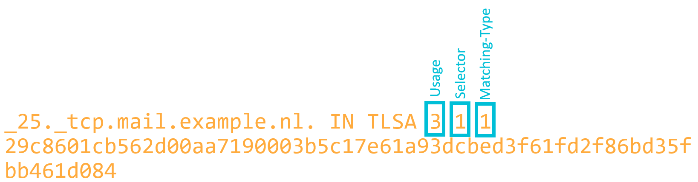
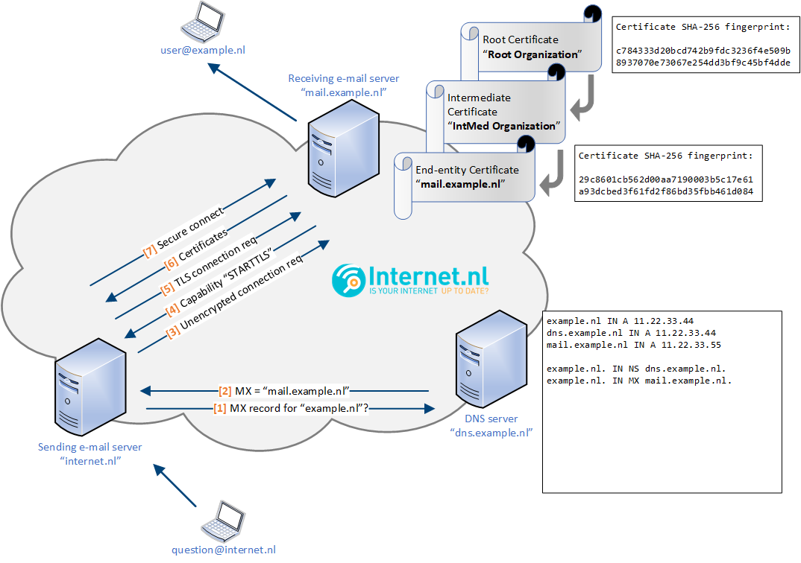
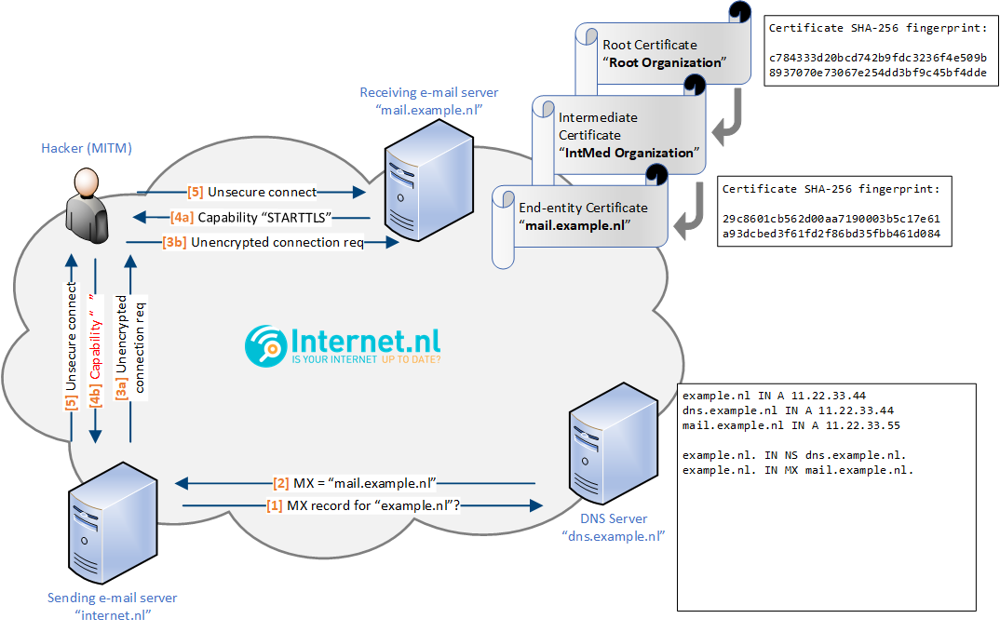
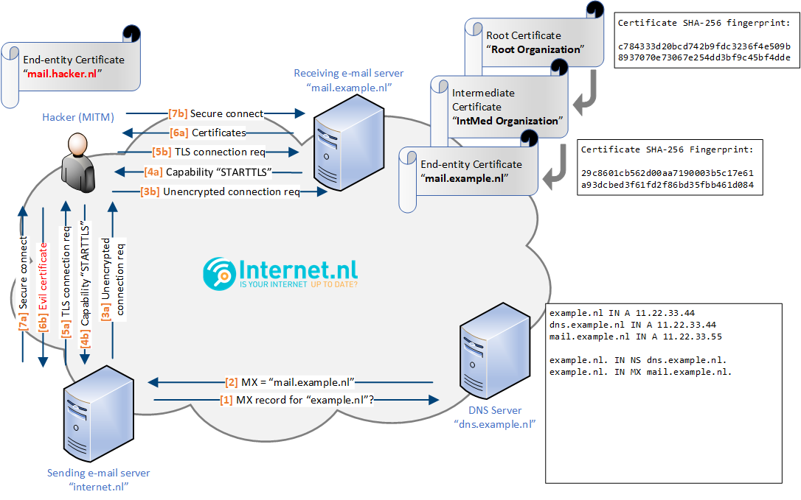
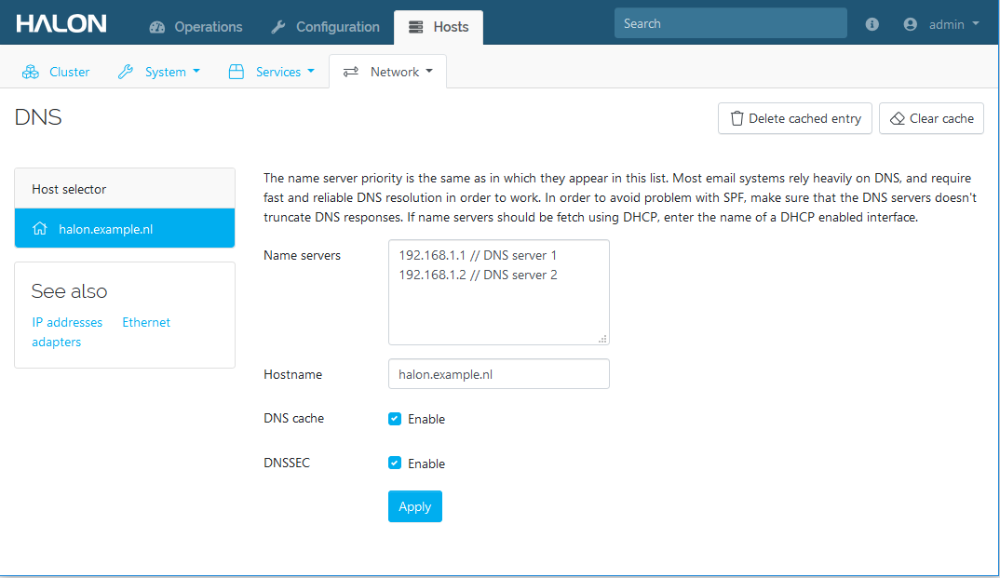

# DANE for SMTP how-to
This how-to is created by the Dutch Internet Standards Platform (the organization behind [Internet.nl](https://internet.nl)) in cooperation with industry experts (hosters and vendors) and is meant to provide practical information and guidance on implementing DANE for SMTP.

# Executive Summary
* DANE is a best-practice technology for securing the transfer of email (SMTP) between organizations across the public Internet.
* Successful DANE deployments require additional operational discipline.
    - Automated monitoring of your own email servers and related DNS records is a must.
    - Robust automation of coordinated DNS and email server certificate chain updates.
    - These topics will be covered in more detail in this how-to.
* Please plan carefully and then deploy DANE for your email servers. Botched deployments not not only harm the domain in question, but also have a deterrent effect on adoption by others.
* For more information on adoption statistics and software support, take a look at: [https://github.com/baknu/DANE-for-SMTP/wiki](https://github.com/baknu/DANE-for-SMTP/wiki)

# Table of contents
- [What is DANE?](#what-is-dane-)
- [Why use DANE for SMTP?](#why-use-dane-for-smtp-)
  * [Risks of SMTP with opportunistic TLS](#risks-of-smtp-with-opportunistic-tls)
  * [DANE addresses these risks](#dane-addresses-these-risks)
  * [How about MTA-STS?](#how-about-mta-sts)
- [DANE TLSA record example](#dane-tlsa-record-example)
- [Advantages of DANE explained by illustrations](#advantages-of-dane-explained-by-illustrations)
  * [Mail delivery: TLS without DANE](#mail-delivery--tls-without-dane)
  * [Mail delivery: TLS with MITM stripping TLS](#mail-delivery--tls-with-mitm-stripping-tls)
  * [Mail delivery: TLS with MITM using evil certificate](#mail-delivery--tls-with-mitm-using-evil-certificate)
  * [Mail delivery: TLS with DANE](#mail-delivery--tls-with-dane)
  * [Mail delivery: TLS with DANE without DNSSEC](#mail-delivery--tls-with-dane-without-dnssec)
- [Reliable certificate rollover](#reliable-certificate-rollover)
  * [Points of attention when rolling over using "current + next"](#points-of-attention-when-rolling-over-using--current---next-)
- [Tips, tricks and notices for implementation](#tips--tricks-and-notices-for-implementation)
- [Inbound e-mail traffic (publishing DANE DNS records)](#inbound-e-mail-traffic--publishing-dane-dns-records-)
  * [Generating DANE records](#generating-dane-records)
  * [Publishing DANE records](#publishing-dane-records)
  * [Generating DANE roll-over records](#generating-dane-roll-over-records)
  * [Publishing DANE roll-over records](#publishing-dane-roll-over-records)
- [Implementing DANE for SMTP on Postfix (inbound & outbound e-mail traffic)](#implementing-dane-for-smtp-on-postfix--inbound---outbound-e-mail-traffic-)
  * [Configuring Postfix](#configuring-postfix)
- [Implementing DANE for SMTP on Exim (inbound & outbound e-mail traffic)](#implementing-dane-for-smtp-on-exim--inbound---outbound-e-mail-traffic-)
  * [Configuration for inbound e-mail traffic](#configuration-for-inbound-e-mail-traffic)
    + [Install or generate key pair](#install-or-generate-key-pair)
    + [Configure TLS](#configure-tls)
  * [Configuration for outbound e-mail traffic](#configuration-for-outbound-e-mail-traffic)
    + [DNSSEC validating resolvers](#dnssec-validating-resolvers)
    + [Configure DNSSEC validation in Exim](#configure-dnssec-validation-in-exim)
    + [Configure DANE](#configure-dane)
- [Implementing DANE for SMTP on Halon (inbound & outbound e-mail traffic)](#implementing-dane-for-smtp-on-halon--inbound---outbound-e-mail-traffic-)
  * [Generic configuration](#generic-configuration)
    + [Install or generate key pair](#install-or-generate-key-pair-1)
    + [DNSSEC](#dnssec)
  * [Inbound](#inbound)
  * [Outbound](#outbound)
    + [Transport Label](#transport-label)
    + [Scripting](#scripting)
    + [Logging](#logging)
- [Implementing DANE for SMTP on Port25 PowerMTA (outbound e-mail traffic)](#implementing-dane-for-smtp-on-port25-powermta--outbound-e-mail-traffic-)
  * [Generic configuration](#generic-configuration-1)
    + [Configure the use of DANE on the domain level](#configure-the-use-of-dane-on-the-domain-level)
    + [Logging](#logging-1)
- [Special thanks](#special-thanks)

<small><i><a href='http://ecotrust-canada.github.io/markdown-toc/'>Table of contents generated with markdown-toc</a></i></small>

# What is DANE?
DANE is short for "**D**NS-based **A**uthentication of **N**amed **E**ntities" and is described in [RFC 6698](https://tools.ietf.org/html/rfc6698) with "updates and operational guidance" in [RFC 7671](https://tools.ietf.org/html/rfc7671). DANE establishes a downgrade-resistant method to verify an SMTP servers identity **before** it starts to transport an email message over a STARTTLS encrypted layer. In order to achieve this it uses verification information retrieved from the recipients DNSSEC signed DNS zone. DANE does not rely on additional trusted parties outside the delegation chain in DNS. 

DANE, as a method, has been designed to work with any TLS service. DANE for SMTP (which is described in [RFC 7672](https://tools.ietf.org/html/rfc7672)) implements the DANE method for SMTP. It is used increasingly and adds active attack (man-in-the-middle) resistance to SMTP transport encryption [RFC 7672 Section 1.3](https://tools.ietf.org/rfc7672#section-1.3). DANE for SMTP uses the presence of DNS TLSA ressource records to **securely signal TLS support** and to publish the means by which SMTP clients can successfully **authenticate legitimate SMTP servers**. The result is called "opportunistic DANE TLS", and resists downgrade and man-in-the-middle (MITM) attacks when the destination domain and its MX hosts are DNSSEC signed, and TLSA records are published for each MX host. While possible, DANE for HTTP is not presently supported by the major browsers and so has seen little deployment.

# Why use DANE for SMTP?
At this time it is not possible to require **mandatory** transport encryption (TLS) in public mail transport. A mail server might not support transporting messages using encryption. Today only plaintext or **opportunistic** transport encryption are applicable – opportunistic because it is up to the receiving server to decide if it wants to and is able to send messages using TLS (via STARTTLS).

DANE offers several advantages by binding X.509 certificates to domains using DNSSEC. In an SMTP context this allows **a)** sending mail servers to securely signal TLS support by the receiving domain's mail server, and **b)** sending mail servers to verify the autenticity of the offered certificate by the receiving domain's mail server. This helps to address risks that occur when using oppurtunistic TLS connections between mail servers.  

## Risks of SMTP with opportunistic TLS
The way SMTP was designed including the usage of opportunistic TLS (via STARTTLS) is not without risks:
* A sending server has no means to determine **beforehand** if the receiving server supports encrypted transport. Only after the communication has begun the sending server may learn from the features the receiving server supports that it allows for encrypted transport.
  * SMTP uses opportunistic TLS (via STARTTLS) as a mechanism to enable secure transport between mail servers. However, the fact that STARTTLS is opportunistic means that the initial connection from one mail server to another always starts unencrypted making it vulnerable to man in the middle attacks. If a mail server does not offer the 'STARTTLS capability' during the SMTP handshake (because it was stripped by an attacker), transport of mail occurs over an unencrypted connection. 
  * Forcing the use of TLS for all mail servers would break backwards compatibility and is therefore not considered a viable option since it could seriously disrupt mail delivery across the internet.
* By default mail servers do not validate the authenticity of another mail server's certificate; any random certificate is accepted (see [RFC 3207](https://tools.ietf.org/html/rfc3207)).
    - It was unclear which CAs to trust when validating the certificate for a given destination.
    - In MTA-to-MTA SMTP, server hostnames for the destination domain are obtained indirectly via DNS MX lookups, but, without DNSSEC, these names cannot be trusted.  As a result, it was unclear which names to verify in the certificate.

As as result, even when STARTTLS is used, a man in the middle attacker:
* can strip the STARTTLS capability send by the receiving mail server because this communication takes place without the use of encryption. 
* can insert any certificate of his choice in the in the unencrypted communication and use it to intercept the traffic.

## DANE addresses these risks
The risks of SMTP with opportunistic TLS can be mitigated by using DANE:
* The presence of a DNS TLSA record for the receiving domain's mail server, should be interpreted by the sending mail server as the capability to use TLS. The use of TLS can therefore be forced when communicating with the receiving domain's mail server.
* The operator of the receiving domain's mail server is obligated to ensure that any published TLSA records at all times match the server's certificate chain, and that STARTTLS is enabled and working. This makes it possible for the sending domain's mail server to validate the certificate offered by the receiving domain's mail server.

In short: DANE allows sending mail servers to unconditionally require STARTTLS with a matching certificate chain. Otherwise, the sending mail server aborts the connection and tries another server or defers the message. Receiving servers with published TLSA records, are therefore no longer vulnerable to the afore mentioned man in the middle attacks.

## How about MTA-STS?
Internet.nl currently does not include MTA-STS in its tests. This paragraph explains why this is the case. 

First you need to understand that, as [explained on our website](https://en.internet.nl/faqs/report/), the selection and development of tests performed by internet.nl is primairily based on:
* the [‘comply-or-explain’ list](https://www.forumstandaardisatie.nl/open-standaarden) of the Dutch Standardisation Forum which is mandatory for all Dutch government agencies;
* security advices of the Dutch NCSC;
* relevant RFC’s of IETF.

Final decisions in this area are made by our steering committee.

MTA-STS is a fairly new standard for enforcing authenticated transport encryption between mail servers. The standard was developed primarily by the big cloud mail providers and seems to especially meet their specific needs. We have seen [quite some uptake of DANE](https://github.com/baknu/DANE-for-SMTP/wiki/4.-Adoption-statistics) (e.g. by Comcast, Protonmail and Cisco), but until now not by the major cloud mail providers. MTA-STS is relatively complex because it needs an extra HTTPS interface (including certificate validation) to function, and it is also considered to be less secure than DANE due to trust on first use and caching. 

MTA-STS relies on trust on first use (TOFU) and policy caching. So the initial connection is just STARTTLS (without authentication of the receiving mail server and without enforcing encryption). During that first connection the MTA-STS policy will be cached by the sending mail server and subsequent encrypted connections will be enforced and authenticated (until the policy cache time expires). This caching mechanism means the larger and more up up-to-date the cache, the better MTA-STS will work. Basically big (cloud) mail providers (that contact about every mail server worldwide each day) will have a large up-to-date policy cache, but smaller mail providers will not and therefore will run more often into trust on first use (i.e. initial less secure connection). So basically MTA-STS seems to offer better security to big players than to the smaller ones. In fact, the MTA-STS RFC [states](https://tools.ietf.org/html/rfc8461#section-10) that DANE offers better downgrade resistance. 

In view of the foregoing and considering the facts that the Dutch NCSC [advises](https://www.ncsc.nl/documenten/factsheets/2019/juni/01/factsheet-beveilig-verbindingen-van-mailservers) to use DANE for securing mail transport, and DNSSEC adoption in the Netherlands (and some other countries like .SE, .NO and .CZ) is quite high and keeps increasing, DANE and not MTA-STS is on the 'comply or explain' list and subsequently included on internet.nl.

Note that MTA-STA and DANE can co-exists next to each other. They intentionally do not interfere.

# DANE TLSA record example


**Usage**: says something about the type of certificate that is used for this TLSA record.  
2: intermediate / root certificate  
3: end-entity certificate (also called 'host certificate' or 'server certificate')

**Selector**: this is about the scope of the fingerprint regarding this TLSA record.  
0: fingerprint with regard to the full certificate  
1: fingerprint with regard to the public key  

**Matching-Type**: information about the hashing mechanism used for fingeeprint regarding this TLSA record.  
0: no hasing, full information  
1: SHA2-256 hash  
2: SHA2-512 hash  

# Advantages of DANE explained by illustrations
## Mail delivery: TLS without DANE
The illustration below shows two TLS capable mail servers without using DANE. This scenario exposes the mail transport to the risks described above.



## Mail delivery: TLS with MITM stripping TLS 
The illustration below shows what happens when an attacker performs a man in the middle (MITM) attack and forces an unsecure connection by stripping the TLS capability from the receiving e-mail server. 

* When an attacker controls the network communication between the sending and receiving server it may downgrade the session by removing the information that indicates the receiving server supports encrypted transport. The sending server would proceed and transport the message unencrypted making all data contained in the message visible to the attacker.



## Mail delivery: TLS with MITM using evil certificate 
The illustration below shows what happens when an attacker performs a man in the middle (MITM) attack and inserts its own certificate into the connection process.

* Traditional SMTP protocol design does not offer any means for a sending server to automatically verify it communicates with the right server. As a result an attacker may fool the sending server to hand over the message to a server under the attackers control. This is called a man-in-the-middle attack, because the attacker places the bad server between the sending and the good receiving server.
* To accieve this the attacker would configure the bad server to identify as the good receiving server. It would even use a TLS certificate that identifies with the name of the good server. The attacker would then poison the sending servers DNS telling it to go to the bad server whenever it wants to send messages to the good one. The fooled server would hand over all messages to the man-in-the-middle server.



## Mail delivery: TLS with DANE
The illustration below shows how the use of DANE can protect against man in the middle (MITM) attacks by addressing the shortcomings of TLS without DANE.

* The operator of the receiving server publishes a TLSA record in its DNSSEC signed zone. The mere existence of the record indicates to the sending server that the recieving server **must** offer STARTTLS. Otherwise transport must not take place.
* The receiving server's TLSA record contains policy information and a string that identifies the correct certificate. Only the good servers certiciate will match these verification criteria. Unless the attacker is also in possesion of the good servers certificate it cannot disguise as good and the man-in-the-middle server will be detected. It the verification data does not match the servers certificate the sending server will not transport the message.


## Mail delivery: TLS with DANE without DNSSEC
Although guaranteeing reliable DNS resolving is actually an advantage of DNSSEC, it is still worth mentioning here. Notice that in the example above (TLS with DANE) the lack of DNSSEC would make it possible for an attacker to alter DNS responses (2 and 4). Such an attack can be used to trick the sender into sending e-mail to a rogue e-mail server. 

# Reliable certificate rollover
A TLSA record identifies a certificate. If the certificate is exchanged for a new one also the associated TLSA record needs to be updated. Otherwise there will be a mismatch, verification will fail and DANE aware servers will not send messages to the receivers domain.

Usually this creates the intent not to exchange the certificate at all. But this collides with best-practices to replace crytographic material – certificates and keys – from time to time.
  
To satisfy both requirements establish these maintenance procedures:
* DANE allows to publish multiple TLSA records. As long as one matches the receving servers certificates everything is fine. Publish **two** sets of TLSA records like this:
  * One TLSA record matching the certificate currently in use.
  * A second TLSA record matching a fallback or future certificate to be used.
* Wait two rounds of **TTL** before you start using a new certicate. This allows clients to clear their DNS cache and pick up the new TLSA record.
* Once the new certificate has been deployed, tested and all is well, the legacy TLSA records may be dropped. Notice that removing the legacy TLSA record too soon can cause an outage. 

Two ways of handling certificate rollover are known to work well, in combination with automated monitoring to ensure that the TLSA records and certificates are always current and correct.

1. **Current + next**. This roll-over scheme always publishes two TLSA records per server certificate.
    - One with the SHA2-256 fingerprint of the mail server's current public key (a "3 1 1" record).
    - And a second with the SHA2-256 fingerprint of the mail server's next public key (also a "3 1 1" record).
2. **Current + issuer**. This roll-over scheme always publishes two TLSA records per mail server certificate.
    - One with the SHA2-256 fingerprint of the mail server's current public key (3 1 1)
    - And a second with the SHA2-256 fingerprint of the public key of an issuing CA that directly or indirectly signed the server certificate (2 1 1). This need not be (and typically is not) a root CA.

## Points of attention when rolling over using "current + next"
* With the "current + next" approach, the second key pair (of which the public key can be used for the **next** TLSA "3 1 1" fingerprint) can be created / known in advance of obtaining the corresponding certificate for *that* key. In particular, if keys are rotated often enough (every 30 to 90 days or so), the next key can be pre-generated as soon as the previous key and certificate are deployed. This allows plenty of time to publish the corresponding **next** "3 1 1" TLSA record to replace the legacy record for the decommissioned key. The process begins again with another "next" key generated right away.
* Deployment of a new certificate and key must be predicated (automated check) on the corresponding TLSA "3 1 1" record being in place for some time, not only on the primary DNS nameserver, but also on all secondary nameservers. Explicit queries against all the servers are to check for this are highly recommended.
* Some servers have keys and certificates for multiple public key algorithms (e.g. both RSA and ECDSA). In that case, not all clients will negotiate the same algorithm and see the same key. This means that a single "3 1 1" record cannot match the server's currently deployed certificate chains. Consequently, for such servers the "3 1 1" current + "3 1 1" next TLSA records need to be provisioned separately for each algorithm. Failure to do that can result in hard to debug connectivity problems with some sending systems and not others.
* Use of the same key (and perhaps wildcard certificate) across all of a domain's SMTP servers (all MX hosts) is **not** recommended. Such keys and certificates tend to be rotated across all the servers at the same time, and any deployment mistakes then lead to an outage of inbound email. Large sites with proper monitoring and carefully designed and automated rollover processes can make wildcard certificates work, but if in doubt, don't overestimate your team's ability to execute this flawlessly.
* When monitoring your systems, test every IPv4 and IPv6 address of each MX host, not all clients will be able connect to every address, and none should encounter incorrect TLSA records, neglected certificates, or even non-working STARTTLS. Also test each public key algorithm, or stick to just one. All DANE-capable SMTP servers support both RSA and ECDSA P-256, so you can pick just RSA (2048-bit key) or ECDSA (P-256).
* Make sure that your servers support TLS 1.2, and offer STARTTLS to all clients, even those that have not sent you email in the past. Denying STARTTLS to clients with no IP "reputation" would lock them out indefinitely if they support DANE, since they then can never send any initial mail in the clear to establish their reputation.

# Tips, tricks and notices for implementation
This section describes several pionts for attention when implementing DANE for SMTP. 

* DANE is meant to be used for the MX domain. So if you are using another domain's mail servers, make sure to ask the administrator of that domain (your mail provider) to support DANE by setting up a TLSA record.
* When implementing DANE we advise to first publish DANE records on your MX domains, and then enable DANE verification on your sending mail servers.
* DANE is backwards compatible. So if your mail server supports DANE and a connecting mail server does not support it yet, usually STARTTLS or plain text is used.
* DANE relies on the security that is provided by DNSSEC. Make your primary domain and MX domain support DNSSEC before implementing DANE. It is important that DNSSEC is implemented properly. A lot of DANE breakage stems from receiving/recipient domains with broken DNSSEC implementations.
* Purchasing of expensive certificates for mail servers has no to little added value for the confidentiality since mail servers don't validate certificates by default. Depending on the context there can be other advantages which makes organizations decide to use specific certificates.
  * It is possible to use self-signed certificates. 
  * [Section 3.2 of RFC 7672](https://tools.ietf.org/html/rfc7672#section-3.2) states that SMTP clients **must not** perform certificate name checks when using an end-entity certificate (usage type 3). However, it also states that SMTP clients **must** perform certificate name checks when using an intermediate or root certificate (usage type 2). The latter is necessary to prevent attackers from abusing a random intermediate or root certificate to falsely validate their evil mail servers.  
  * [Section 3.1 of RFC 7672](https://tools.ietf.org/html/rfc7672#section-3.1) states that the expiration date of the end-entity certificate MUST be ignored.
* It is highly recommended to use a certificates public key for generating a TLSA signature (selector type "1") instead of the full certificate (selector type "0"), because this enables the reuse of key materials. Although it is wise to refresh your key material once in a while, note that the use of Forward Secrecy decreases the need to use a new key-pair on every occasion. 
  * See also this [example of Let's Encrypt](https://mail.sys4.de/pipermail/dane-users/2019-December/000545.html). In this case the issuer certificate was changed, but the public key was not. As a result a "2 1 1" roll-over record would still validate, but a "2 0 1" roll-over record would not and requires an update. 
* An issuer certificate (usage type "2") validates only when the full certificate chain is offered by the receiving mail server. 
* Mail servers by default don't validate certificates and therefore don't have their own certificate store. That's why DANE for SMTP only supports usage type "2" (DANE-TA) and usage type "3" (DANE-EE). Usage type "0" (PKIX-TA) and usage type "1" (PKIX-EE) are not supported. 
* Make sure the TTL (time-to-live) of your TLSA records is not too high. This makes it possible to apply changes relatively fast in case of problems. A TTL between 30 minutes (1800) and 1 hour (3600) is recommended.
* The refresh value of your full DNS zone should be in accordance with the TTL setting of your TLSA record, to make sure all name servers give the same information when (after expiration of the TLSA TTL) being queried.
* In case of roll-over scheme "current + issuer", the use of the root certificate is preferred because in some contexts ([PKIoverheid](https://en.wikipedia.org/wiki/PKIoverheid)) this makes it easier to switch supplier / certificate without impacting DANE. (Remember [DigiNotar](https://en.wikipedia.org/wiki/DigiNotar)). 
* Roll-over scheme "current + next" gives less flexibility but the highest form of certainty, because of "tight pinning".
* Implement monitoring of your DANE records to be able to detect problems as soon as possible. 
* Make sure your implementation supports the usage of a CNAME in your MX record. There are some inconsistencies between multiple RFC's. According to [RFC 2181](https://tools.ietf.org/html/rfc2181#section-10.3) a CNAME in MX records is not allowed, while [RFC 7671](https://tools.ietf.org/html/rfc7671#section-7) and [RFC 5321](https://tools.ietf.org/html/rfc5321#section-5.1) imply that the usage of a CNAME in MX records is allowed.
* Using Server Name Indication (SNI) in an e-mail environment (for matching the certificate offered by a recieving e-mail server) is only usefull when DANE and DNSSEC are used. DNSSEC to perform a reliable MX lookup and DANE to verify the authenticity of the certificate. Sending e-mail servers (the TLS client) usually don't use SNI, because some receiving e-mail servers (the TLS server) cannot handle this; in some cases the setting up of a TLS connection fails. For more information see [RFC 7672 section 8.1](https://tools.ietf.org/html/rfc7672#section-8.1) and [this blogpost by Filippo Valsorda](https://blog.filippo.io/the-sad-state-of-smtp-encryption/). 
* Make sure you keep an eye on the logs of your sending mail server to see what domains fail DANE verification.
* Some software allows for a test mode. This means that DANE verification is done and logged but there’s no consequence for delivery if DANE verification fails.
* Manually verify a mail server's certificate with the following commands:
  * get the DANE record: `dig tlsa _25._tcp.mail.example.nl`
  * verify certificate against TLSA record `openssl s_client -starttls smtp -connect mail.example.nl:25 -dane_tlsa_domain "mail.example.nl" -dane_tlsa_rrdata "3 1 1 29c8601cb562d00aa7190003b5c17e61a93dcbed3f61fd2f86bd35fbb461d084"`.
* Check if DANE TLSA records (_25._tcp.mail.example.nl) are properly DNSSEC signed. A regularly occuring mistake is the presence of "proof of non-existence" (NSEC3) for the ancestor domain (_tcp.mail.example.nl). If this happens then resolvers that use qname minimization (like the resolver used by [Internet.nl](https://internet.nl)) think that _25._tcp.mail.example.nl does not exists since _tcp.mail.example.nl does not exists. Therefore the resolver can't get the TLSA record which makes DANE fail. 
  * Check your DNSSEC implementation on [DNSViz](https://dnsviz.net/). Enter "_25._tcp.mail.example.nl".
  * You can also manually check for this error. `dig _25._tcp.mail.example.nl tlsa +dnssec` results in a NOERROR response, while `dig _tcp.mail.example.nl tlsa +dnssec` results in a NXDOMAIN response. 

# Inbound e-mail traffic (publishing DANE DNS records)
This part of the how-to describes the steps that should be taken with regard to your inbound e-mail traffic, which primairily involves publishing DANE DNS records. This enables other parties to use DANE for validating the certificates offered by your e-mail servers. 

## Generating DANE records
**Primary mail server (mail1.example.nl)**

Generate the DANE SHA-256 hash with the following command:

`openssl x509 -in /path/to/primary-mailserver.crt -noout -pubkey | openssl pkey -pubin -outform DER | openssl sha256`

This command results in the following output:
 
> (stdin)= 29c8601cb562d00aa7190003b5c17e61a93dcbed3f61fd2f86bd35fbb461d084

**Secondary mail server (mail2.example.nl)**

For the secondary mail server we generate the DANE SHA-256 hash using the command:

`openssl x509 -in /path/to/secondary-mailserver.crt -noout -pubkey | openssl pkey -pubin -outform DER | openssl sha256`

This command results in the following output: 
> (stdin)= 22c635348256dc53a2ba6efe56abfbe2f0ae70be2238a53472fef5064d9cf437

## Publishing DANE records
Now that we have the SHA-256 hashes, we can construct the DNS records. We make the following configuration choices:
* Usage field is "**3**"; we generated a DANE hash of the leaf certificate itself (DANE-EE: Domain Issued Certificate).
* Selector field is "**1**"; we used the certificates' public key to generate DANE hash/signature.
* Matching-type field is "**1**"; we use SHA-256.

With this information we can create the DNS record for DANE:

> _25._tcp.mail.example.nl. IN TLSA 3 1 1 29c8601cb562d00aa7190003b5c17e61a93dcbed3f61fd2f86bd35fbb461d084  
> _25._tcp.mail2.example.nl. IN TLSA 3 1 1 22c635348256dc53a2ba6efe56abfbe2f0ae70be2238a53472fef5064d9cf437

## Generating DANE roll-over records
We use the provided bundle file for generating the DANE hashes belonging to the root certificate. In order to do that, we first split the bundle file into multiple certificates using `cat ca-bundle-file.crt | awk 'BEGIN {c=0;} /BEGIN CERT/{c++} { print > "bundlecert." c ".crt"}'`. In this specific case this results in two files: _bundlecert.1.crt_ and _bundlecert.2.crt_.

For each file we view the **subject** and the **issuer**. We start with the first file using the following command:

`openssl x509 -in bundlecert.1.crt -noout -subject -issuer`

This results in the following output:

> subject=C = GB, ST = Greater Manchester, L = Salford, O = Sectigo Limited, CN = Sectigo RSA Domain Validation Secure Server CA  
> issuer=C = US, ST = New Jersey, L = Jersey City, O = The USERTRUST Network, CN = USERTrust RSA Certification Authority

For the second file we use the command:

`openssl x509 -in bundlecert.2.crt -noout -subject -issuer`

This results in the following output:
> subject=C = US, ST = New Jersey, L = Jersey City, O = The USERTRUST Network, CN = USERTrust RSA Certification Authority  
> issuer=C = US, ST = New Jersey, L = Jersey City, O = The USERTRUST Network, CN = USERTrust RSA Certification Authority

Based on the information of these two certificates, we can conclude that the second certificate (bundlecert.2.crt) is the root certificate; since root certificates are self-signed the **subject** and the **issuer** are the same. The other certificate (bundlecert.1.crt) is an intermediate certificate which is (in this case) signed by the root certificate. 

## Publishing DANE roll-over records
Because we prefer the root certificate to be our roll-over anchor, we generate the DANE SHA-256 hash using the command:

`openssl x509 -in bundlecert.2.crt -noout -pubkey | openssl pkey -pubin -outform DER | openssl sha256`

This results in the following output:

> (stdin)= c784333d20bcd742b9fdc3236f4e509b8937070e73067e254dd3bf9c45bf4dde

Since both certificates for the primary and secondary come from the same Certificate Authority, they both have the same root certificate. So we don't have to repeat this with a different bundle file.

Now that we have the SHA-256 hash, we can construct the DANE roll-over DNS records. We make the following configuration choices:
* Usage field is "**2**"; we generated a DANE hash of the root certificate which is in the chain the chain of trust of the actual leaf certificate (DANE-TA: Trust Anchor Assertion). 
* Selector field is "**1**"; because we use the root certificate's public key to generate a DANE hash.
* Matching-type field is "**1**"; because we use SHA-256.

With this information we can create a rollover DNS record for DANE:
> _25._tcp.mail.example.nl. IN TLSA 2 1 1 c784333d20bcd742b9fdc3236f4e509b8937070e73067e254dd3bf9c45bf4dde  
> _25._tcp.mail2.example.nl. IN TLSA 2 1 1 c784333d20bcd742b9fdc3236f4e509b8937070e73067e254dd3bf9c45bf4dde

# Implementing DANE for SMTP on Postfix (inbound & outbound e-mail traffic)

**Specifics for this setup**
* Linux Debian 9.8 (Stretch) 
* SpamAssassin version 3.4.2 (running on Perl version 5.28.1)
* Postfix 3.4.5
* BIND 9.10.3-P4-Debian
* Two certificates (for two mail servers) from Comodo / Sectigo

**Assumptions**
* DNSSEC is used
* Mail server is operational
* Software packages are already installed

## Configuring Postfix
Postfix plays an important role in using DANE for validating the when available.

Make sure the following entries are present in **/etc/postfix/main.cf**

`smtp_dns_support_level = dnssec`  

This setting tells Postfix to perform DNS lookups using DNSSEC. This is an important prerequisite for DANE to be effective, since regular DNS lookups can be manipulated. Without DNSSEC support, Postfix cannot use DANE.

`smtp_tls_security_level = dane`  

By default Postfix uses opportunistic TLS (smtp_tls_security_level = may) which is susceptible to man in the middle attacks. You could tell Postfix to use mandatory TLS (smtp_tls_security_level = encrypt) but this breaks backwards compatibility with mail servers that don't support TLS (and only work with plaintext delivery). However, when Postfix is configured to use the "dane" security level (smtp_tls_security_level = dane) it becomes resistant to man in the middle attacks, since Postfix will connect to other mail servers using "mandatory TLS" when TLSA records are found. This means that: 
* If TLSA records are found but are unusable, Postfix will NOT fallback to opportunistic TLS (STARTTLS) or ultimately plaintext delivery. 
* If no TLSA records are found (and thus DANE is not supported), Postfix will fallback to opportunistic TLS (STARTTLS) or ultimality plaintext delivery.

To enforce DANE you can use "smtp_tls_security_level = dane-only" (aka mandatory DANE). With this setting a sending mail server makes sure there is no fallback to opportunistic TLS (STARTTLS) or plaintext when either the TLSA records are unusable or absent. It is possible to use mandatory DANE on a per domain basis. For example when you know a certain domain should support DANE and you want to be absolutely sure that a secure and validated delivery is used and want to prevent fallbacks to a less secure delivery method. 

`smtp_host_lookup = dns`  

This tells Postfix to perform lookups using DNS. Although this is default behavior it is important to make sure this is configured, since DANE won't be enabled if lookups are performed using a different mechanism.

`smtpd_tls_CAfile = /path/to/ca-bundle-file.crt`  

When applying a DANE roll-over scheme using an "issuer certificate" (an intermediate or root certificate), Postfix must be able to provide the certificates of the used issuer in the chain of trust. Hence this setting.

# Implementing DANE for SMTP on Exim (inbound & outbound e-mail traffic)
**Specifics for this setup**
* Ubuntu 18.10 ‘Cosmic Cuttlefish’ 
* Exim 4.92 (DANE support is non-experimental since version 4.91)

**Assumptions**
* DNSSEC is used
* Mail server is operational

## Configuration for inbound e-mail traffic

### Install or generate key pair
You can use a commercial or Let's Encrypt certificate, but you can also generate your own key pair by using the provided Exim tools. Use the following command to generate a key pair.

`sudo bash /usr/share/doc/exim4-base/examples/exim-gencert`

### Configure TLS 
In Exim you should configure TLS by adding the following to **main/03_exim4-config_tlsoptions**

    MAIN_TLS_ENABLE = yes
    tls_advertise_hosts = *
    tls_certificate = /path/to/certificate.crt
    tls_privatekey = /path/to/private.key

## Configuration for outbound e-mail traffic
This part of the how-to describes the steps that should be taken with regard to your outbound e-mail traffic. This enables your e-mail environment to use DANE for validating the certificates offered by other e-mail servers. 

### DNSSEC validating resolvers
Make sure to configure DNSSEC validating resolvers on the mail server. When using the locale systemd resolver, make sure to add the following to **/etc/systemd/resolved.conf**.

`DNSSEC = yes`

### Configure DNSSEC validation in Exim
In Exim you explicitly need to configure DNSSEC validation by adding the following to **main/02_exim4-config_options** since some resolvers only validate DNSSEC on request. 

`dns_dnssec_ok = 1`

### Configure DANE
In order to use DANE, you should tell Exim to check for DANE records when sending e-mail. You can configure DANE validation to be mandatory by adding the following to **transport/30_exim4-config_remote_smtp**. 

`hosts_require_dane = *`

This means that TLS connections are not accepted when the domain you are trying to send mail to does not have a valid TLSA record. Since this is rather strict and not recommended to be the default, you are probably better of by configuring DANE validation to be additional. This can be done by adding the following to **transport/30_exim4-config_remote_smtp**.

`hosts_try_dane = *`

Notice that depending on the way you configured Exim, you need to apply DANE for all [SMTP transports](https://www.exim.org/exim-html-current/doc/html/spec_html/ch-how_exim_receives_and_delivers_mail.html#SECTprocaddress).

# Implementing DANE for SMTP on Halon (inbound & outbound e-mail traffic)
Several Dutch hosting providers use Halon (a scriptable SMTP server who's virtual appliances are based on FreeBSD) as the internet facing e-mail server. The actual mail boxes reside on Direct Admin (which uses Exim) within the internal network. In this specific setup you could say that all security features are applied at the internet facing mail server which is Halon. 

Halon has built-in support for DANE and can be configured in several ways, this how-to uses the built-in web interface. For more information on configuration you can visit [https://halon.io/dane](https://halon.io/dane) and [https://wiki.halon.io/DANE](https://wiki.halon.io/DANE).

**Specifics for this setup**
* HALON 5.1-p3-argy

**Assumptions**
* Basic configuration of Halon

## Generic configuration
### Install or generate key pair

Navigate to: `Configuration -> Email engine - > Certificates and keys -> Add`

- Give an ID (name) for the certificate: only lowercase, numbers and letters (limitation of Halon). 
- Select type “X.509 and private key” and hit *Generate* and fill in the fields or upload a certificate (chain with private key).
- Add a comment like name of the CN and date of validity.

### DNSSEC
If you have a local (in your own network) DNSSEC resolver available, you can use that one. Otherwise use the internal resolver of Halon, which is based on unbound.

Navigate to: `Hosts -> Network -> DNS`
Name servers: enter here your resolving nameservers.
DNS cache: Enable (now the DNSSEC option is visible)
DNSSEC: Enable



If you have multiple hosts in a cluster, edit the DNS settings for all the hosts.

## Inbound
Navigate to: `Configuration -> Email engine -> Settings`

If you already have an inbound SMTP listener configured, you should upgrade this one to DANE. You can also create a new listener by navigating to `Configuration -> Server -> SMTP listeners -> Add`

- STARTTLS: Enable
- Certificate: Select the certificate you want to use from the dropdown menu. 


## Outbound
There a multiple ways to enable outbound DANE: through a Transport Label or scripting.

### Transport Label
Navigate to: `Configuration -> Email Engine -> Transport labels`

Select the transport labels ID if you want to upgrade an existing one, otherwise click *Add* to create a new one.

- Destination hostname and port: Select Deliver to MX.
- TLS STARTTLS: Select "DANE" or "DANE (required)" in the dropdown menu.


Notice: with "DANE (required)" there is no fallback to TLS or none option.

If you created a new "Transport Label" use that one in a Script mapping as Transport to use the DANE enabled delivery.

### Scripting
With the SetTLS function in pre-delivery you can set the TLS options for that specific delivery attempt.

`SetTLS(["tls" => "dane”]);`

`SetTLS(["tls" => "dane_require”]);`

### Logging

In the logging you can see whether delivery via DANE is used.

Example logging:
```
Processing message from <mail@example.nl> to <danedomain@example.nl> with daneenabled
Delivering message to example.nl:25
Connecting to [192.168.1.1]:25 (DNSSEC)
Connection is now using TLSv1.3 with cipher TLS_AES_256_GCM_SHA384 (256 bits) (DANE)
Successful delivery to <danedomain@example.nl> (retry 0) in 2.108s: 2.0.0 example.org accepted message 0123456789ABCD
Deleting mail file (all recipients done)
```

# Implementing DANE for SMTP on Port25 PowerMTA (outbound e-mail traffic)
Various Email Service Providers (ESP) are using Port25 PowerMTA as their preferred outbound MTA.

Port25 has build-in support for DANE since version v5.0

**Specifics for this setup**
* Port25 PowerMTA v5.x+

**Assumptions**
* Basic configuration of PowerMTA
* TLS Certificate already in place
* STARTTLS active (`use-starttls	yes`)
* DNSSEC capable DNS resolver

## Generic configuration
### Configure the use of DANE on the domain level

Within the configuration of a specific domain
```
  <domain example.com>
    use-dane true
  </domain>
```

  Within the configuration of all domains
```
    <domain *>
      use-dane true
    </domain>
```

If TLS is required per DANE for SMTP `use-starttls` and `require-starttls` will be overridden.

### Logging

By enabling the resolver logging (`log-resolution yes`) you are able to see the DNS queries for the TLSA records.

Within the configuration of a specific domain
```
  <domain example.com>
    log-resolution yes
  </domain>
```

  Within the configuration of all domains
```
    <domain *>
      log-resolution yes
    </domain>
```

By enabling the TLS logging (`log-tls yes`) you are able to see the TLS DANE verification.

Within the configuration of a specific domain
```
  <domain example.com>
    log-tls yes
  </domain>
```

  Within the configuration of all domains
```
    <domain *>
      log-tls yes
    </domain>
```

Example logging:

DNS Resolver
```
Starting new query for TLSA _25._tcp.jail.internet.nl:
answer _25._tcp.jail.internet.nl. 3600 IN CNAME 3.1.1._dane.internet.nl.
answer _25._tcp.jail.internet.nl. 3600 IN CNAME 3.1.1._dane.internet.nl.
answer 3.1.1._dane.internet.nl. 3600 IN TLSA 3 1 1 25DE2127E359B8522DDD6E237381458804549CDE5440E4F5B547C5629E48D46B
_25._tcp.jail.internet.nl. 3600 IN CNAME 3.1.1._dane.internet.nl.
_25._tcp.jail.internet.nl. 3600 IN CNAME 3.1.1._dane.internet.nl.
3.1.1._dane.internet.nl. 3600 IN TLSA 3 1 1 25DE2127E359B8522DDD6E237381458804549CDE5440E4F5B547C5629E48D46B
```
TLS Logging
```
tls: TLSv1.2 connected with 256-bit ECDHE-RSA-AES256-GCM-SHA384
tls: cert: /C=NL/ST=Zuid-Holland/L=Den Haag/XXXXXXX; issuer=/C=NL/O=XXXXXXX; verified=yes
tls: DANE match: /C=NL/ST=Zuid-Holland/L=XXXXXX; issuer=XXXXX; depth=0
```

# Special thanks
Our infinite gratitude goes out to the following people for their support in building this how-to for DANE.

Alexander Brotman  
Alwin de Bruin  
Anders Berggren  
Marc van de Geijn  
Mark Scholten  
Patrick Koetter  
Simon Besteman  
Tom van Leeuwen  
Viktor Dukhovni  
Wido Potters  
